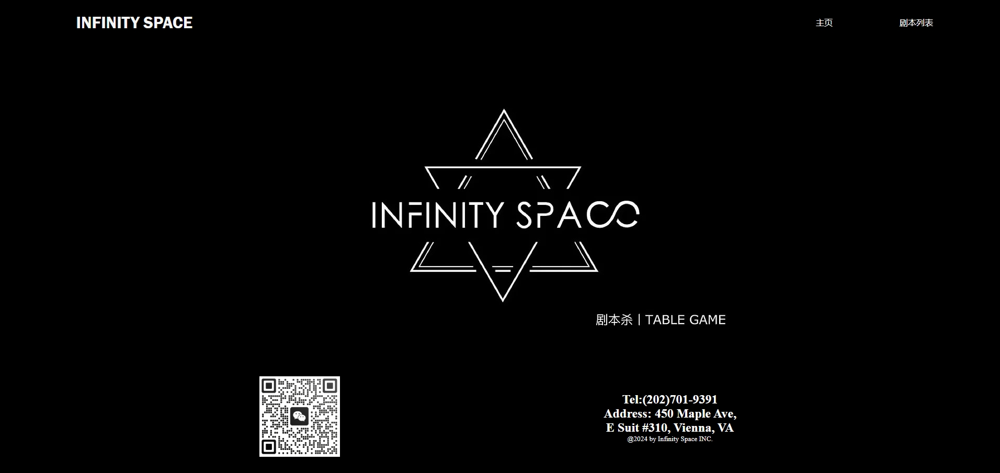
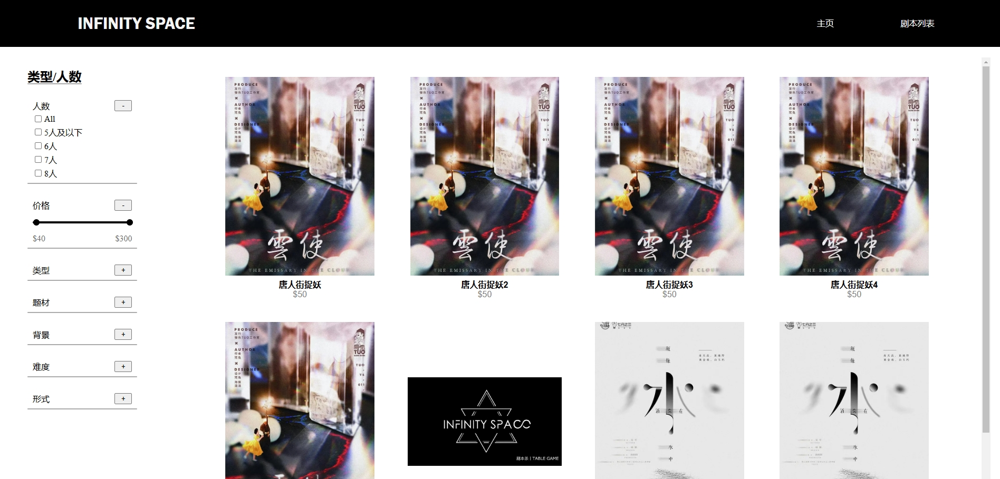
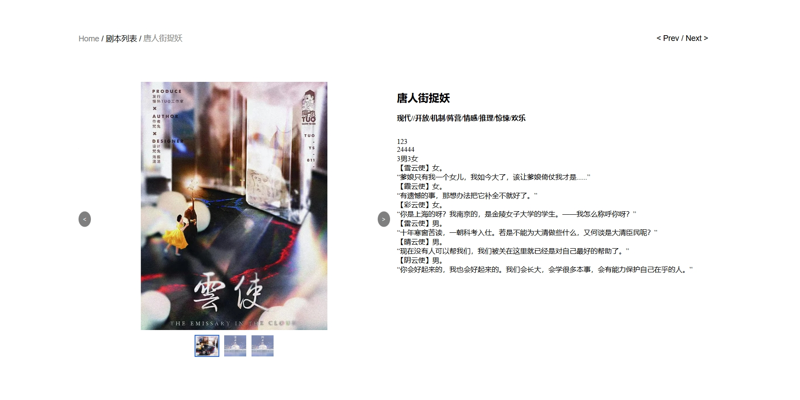

# JubenshaWeb

**JubenshaWeb** is a dynamic web application designed for the popular table game "Jubensha." The platform enables users to explore and choose from a variety of engaging storylines, making it easy for players to find a game that suits their preferences. Users can filter available storylines based on different categories such as the number of players, price ranges, story backgrounds, and difficulty levels.

Each storyline has a dedicated detail page, which provides all necessary information to help users decide if the game is the right fit for them. 

## Key Features

- **Browse Storylines**: View a diverse collection of storylines categorized by:
  - Number of players
  - Price range
  - Story background style
  - Difficulty levels

- **Filter and Search**: Easily search and filter storylines using the multiple category search functionality.

- **Story Details**: Each story page provides detailed information to help customers make informed choices before selecting a storyline.

- **Responsive Design**: The app ensures a smooth and optimized experience across both desktop and mobile devices.

## Tech Stack

- **Frontend**: 
  - **TypeScript**: Ensuring type safety and a more predictable development experience.
  - **React.js**: For building dynamic, state-driven components and a seamless user interface.
  - **Vite**: For fast and optimized builds, reducing development and production bundling times.

## Screenshots

Here are some screenshots of the application in action:

### Home Page

### List View (Storylines)

### Story Details

